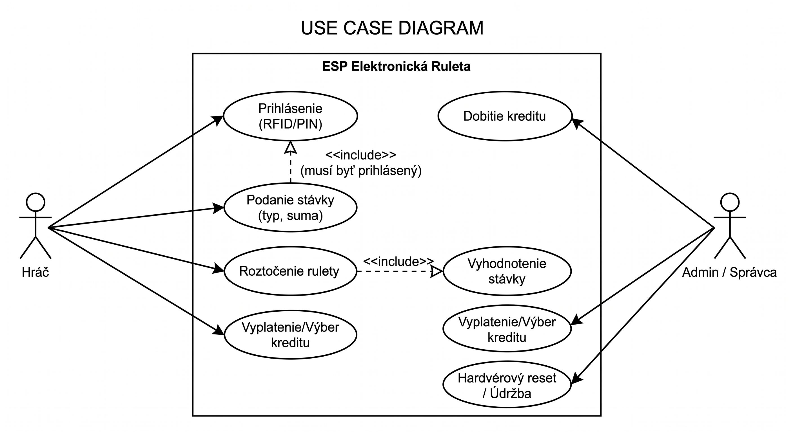
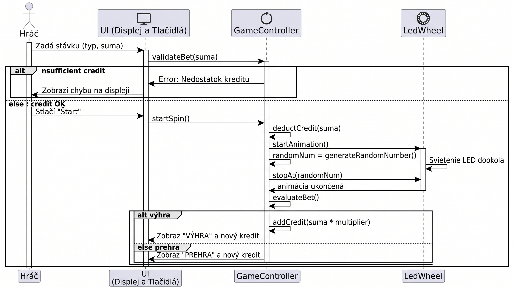
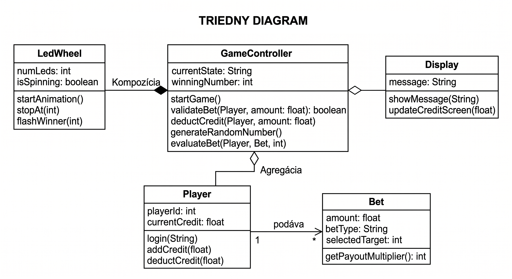

# Systémová analýza projektu: ESP Fyzická elektronická ruleta

## Dôvod a okolnosti zavedenia riešenia

Projekt vznikol s cieľom vytvoriť fyzickú elektronickú ruletu zameranú na lokálne hranie. Klasický mechanizmus rulety a guličky je nahradený mikrokontrolérom (napr. ESP32/ESP8266), digitálnym displejom (OLED/LCD), ovládacími tlačidlami a kruhom s priesvitnými políčkami, pod ktorými sú umiestnené LED diódy.

Cieľom je vytvoriť interaktívne zariadenie, kde sa používateľ prihlási, spravuje svoj kredit, cez displej a tlačidlá si navolí stávku (číslo, farba, parita) a následne spustí hru. Animácia LED diód nasimuluje pohyb guličky s postupným spomaľovaním, až kým sa nezastaví na výhernom čísle. Systém sa riadi klasickými pravidlami rulety.

---

## Slovné zadanie, popis projektu od zákazníka

Cieľom projektu je vytvoriť prehľadnú a intuitívne ovládateľnú ESP fyzickú elektronickú ruletu.

Hráč sa po prihlásení dostane k správe svojho kreditu a možnosti podania stávky prostredníctvom tlačidiel a digitálneho displeja.

Môže si zvoliť stávku na presné číslo, farbu alebo párnosť čísla, podobne ako pri klasickej rulete.

Po potvrdení stávky systém spustí simuláciu roztočenia rulety pomocou LED diód umiestnených pod priesvitnými políčkami.

Softvér vygeneruje náhodné výherné číslo, zastaví svietiacu LED diódu na príslušnom mieste, vyhodnotí stávku a podľa toho upraví kredit hráča.

---

## Zoznam modulov projektu a ich významných atribútov

### 1. Herný modul (GameController)

**Atribúty:**
- aktuálny stav hry
- výherné číslo
- overenie kreditu

**Unikátna identifikácia objektov:** `game.id`

### 2. Modul Hráča (Player)

**Atribúty:**
- identifikátor hráča
- aktuálny kredit
- správa zostatku (pridanie/odčítanie)

**Unikátna identifikácia objektov:** `player.id`

### 3. Modul Stávky (Bet)

**Atribúty:**
- suma stávky
- typ stávky (číslo, farba, párnosť)
- zvolený cieľ
- výpočet výherného násobku

**Unikátna identifikácia objektov:** `bet.id`

### 4. Modul LED Kolesa (LedWheel)

**Atribúty:**
- počet LED diód
- stav točenia
- ovládanie animácie

**Unikátna identifikácia objektov:** `wheel.id`

### 5. Používateľské rozhranie (Display)

**Atribúty:**
- zobrazenie textových správ
- zobrazenie aktuálneho kreditu
- aktualizácia obrazovky

**Unikátna identifikácia objektov:** `display.id`

---

## Systémové požiadavky FURPS

### 1. Funkčnosť (Functionality – F)

- Systém musí umožňovať používateľovi prihlásenie/založenie relácie.
- Systém musí umožniť dobitie a sledovanie aktuálneho kreditu.
- Systém musí umožňovať podanie stávky (výber typu stávky a jej sumy).
- Hardvérové generovanie náhodného čísla (0-36).
- Simulácia točenia rulety prostredníctvom svetelnej animácie LED.
- Automatické vyhodnotenie stávky a aktualizácia kreditu.

### 2. Vhodnosť k použitiu (Usability – U)

- Intuitívne ovládanie limitovaným počtom hardvérových tlačidiel.
- Prehľadné zobrazenie stavu hry, stávky a kreditu na digitálnom displeji.
- Zreteľná vizuálna spätná väzba na LED kolese (rozlíšenie farieb: červená, čierna, zelená pre 0).

### 3. Spoľahlivosť (Reliability – R)

- Stabilný chod programu na ESP mikrokontroléri bez zamŕzania.
- Zabezpečenie zachovania kreditu v prípade neočakávaného výpadku prúdu.

### 4. Výkon (Performance – P)

- Plynulá animácia LED diód bez sekania s dynamickým znižovaním rýchlosti (simulácia fyziky trenia).
- Okamžitá odozva (do 100 ms) na stlačenie ovládacích tlačidiel.

### 5. Schopnosť údržby (Supportability – S)

- Modulárny kód napísaný v jazyku C/C++ (rozdelená logika hry, ovládania displeja a obsluhy LED).
- Jednoduchá vymeniteľnosť hardvérových komponentov.

---

## Kritické situácie

### 1. Systémové

- Zlyhanie komunikácie s displejom alebo LED pásikom.
- Výpadok napájania počas vyhodnocovania stávky.
- Chyba pri generovaní náhodného čísla.

### 2. Aplikačné

- Hráč sa pokúsi staviť sumu vyššiu ako je jeho aktuálny kredit.
- Hráč sa pokúsi zadať neplatnú kombináciu stávky.
- Neúspešné prihlásenie hráča.

---

## Tri situácie definujúce hranice systému

### 1. Ideálny scenár

Hráč sa prihlási, skontroluje dostatočný kredit, zadá stávku cez tlačidlá. Systém stávku prijme, spustí animáciu rulety, vygeneruje náhodné číslo, LED zastane na čísle a systém korektne pripočíta výhru ku kreditu hráča, čo sa ihneď zobrazí na displeji.

### 2. Hranične riešiteľný scenár

Hráč má nízky kredit a pokúsi sa staviť sumu vyššiu, ako mu zostatok dovoľuje. Systém stávku zamietne, zobrazí chybovú hlášku o nedostatku kreditu, ale nepreruší reláciu hráča. Hráč môže zadať novú stávku so sumou odpovedajúcou jeho zostatku.

### 3. Situácie, ktoré aplikácia nezvládne

Zariadenie počas prebiehajúcej animácie alebo tesne po vygenerovaní výherného čísla stratí napájanie, pričom kredit nebol ešte trvalo uložený do EEPROM/Flash pamäte, čo spôsobí stratu informácie o výsledku tohto kola a prípadnú stratu vsadeného kreditu.

---

## Kontext prostredia

Aplikácia (firmvér) bude bežať na mikrokontroléri ESP (ESP32/ESP8266).

Hardvérové rozhranie sa bude skladať z digitálneho displeja (OLED/LCD), LED diód umiestnených pod priesvitnými políčkami rulety a mechanických tlačidiel na ovládanie.

K hraniu je potrebný fyzický prístup k zariadeniu, nevyžaduje sa pripojenie k sieti internet pre základnú funkcionalitu (okrem prípadnej synchronizácie s centrálnym systémom kreditu).

---

## Charakteristika aktérov a prostredia

### Aktéri

- Hráč
- Administrátor / Správca

### Prostredie

- fyzické zariadenie rulety s mikrokontrolérom, displejom a tlačidlami

Hráč používa zariadenie na podávanie stávok a sledovanie priebehu hry.

Administrátor sa stará o údržbu zariadenia, prípadné dobíjanie kreditu (ak to nie je automatizované napr. RFID) a hardvérový reset.

---

## Use Case diagram

---

## Scenáre – konkrétna implementácia Use Case

### 1. Podanie stávky a roztočenie

**Názov:** Podanie stávky a roztočenie

**Kontext:**
Hráč chce vsadiť na vybraný typ stávky a spustiť hru.

**Level zanorenia Use Case:**
Hlavný scenár

**Aktéri:**
Hráč, ESP Systém

**Stakeholderi a záujmové osoby:**
Hráč, Administrátor/Prevádzkovateľ

### Vstupné podmienky

- Zariadenie je zapnuté.
- Hráč je prihlásený a má kladný zostatok kreditu.

### Výstupné podmienky

- Systém vyhodnotí hru a aktualizuje kredit hráča.

### Minimálny výstup

Systém prijme stávku, zablokuje ju z kreditu, prebehne vizuálna animácia a hráč vidí na displeji výsledok (výhra/prehra).

### Ideálny výstup

Hráč stlačí 'Štart', systém okamžite odpočíta kredit, bez pádov prehrá plynulú animáciu, ktorá spomaľuje až kým nezastane na náhodnom čísle a správne pripočíta hráčovi výhru podľa kurzu, čo mu okamžite ukáže na displeji.

### Hlavný scenár

1. Zariadenie na displeji vyzve hráča na voľbu stávky.
2. Hráč pomocou tlačidiel prepína medzi typmi stávok a navolí výšku stávky.
3. Hráč stlačí tlačidlo 'Štart'.
4. Systém preverí zostatok a odčíta stávku.
5. Systém vygeneruje náhodné číslo a spustí LED animáciu.
6. Animácia sa zastaví na výhernom poli.
7. Systém vyhodnotí stávku, aktualizuje kredit a zobrazí výsledok.

### Rozšírenie

- Ak systém v kroku 4 zistí nedostatočný kredit, vydá chybový signál a vyzve hráča na úpravu stávky.

---

## Sekvenčný diagram

---

## Triedny diagram

